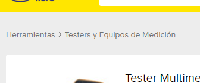
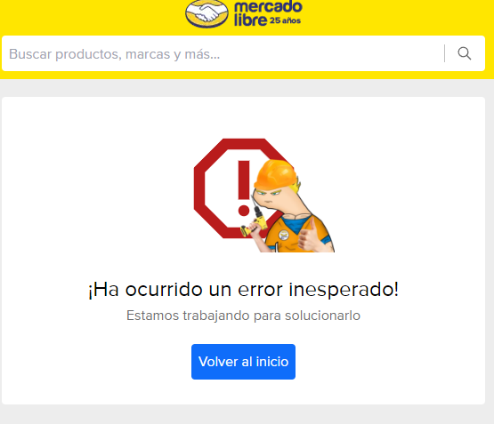

# MELI - Challenge

This project is a web application developed using modern technologies. The frontend is built with React.js, Next.js, TypeScript, and Jest, while the backend is powered by Node.js and Express. The application has been optimized for high performance, achieving a 100% score in Lighthouse. Additionally, it includes unit tests that cover 100% of the codebase (Frontend).

- ## Lighthouse


- ## Frontend


# Observations

## 1. Filtering by category, sort, display limit and pagination

The application offers the possibility of filtering items by category, sort, display limit and pagination.

- ### Category



- ### Sort


- ### Limit


- ### Pagination


## 2. Skeletons

Skeleton screens are implemented for the items and description pages to enhance the visual experience while the page is loading.

- ### Items


- ### Description


## 3. Change - API schema

The response schema has been updated to include additional information such as categories and pagination details..

## 4. Sold_quantity - not available

The sold_quantity field is not available in the Mercado Libre API. Although the logic is implemented to return this field, it cannot be included in the response schema of the endpoint due to its absence in the API.


## 5. Change colors

Some colors have been slightly adjusted from Mercado Libre's main page to meet accessibility standards. For example, changes include the breadcrumb colors, the "Free Shipping" label, and others.

## 6. Alert views

Alert views have been added for special cases, such as when accessing non-existent pages or when the API returns errors.

- ### Error page




- ### Not Found page


## 7. Technical debt - coverage

Although the project is configured to run unit tests, due to time constraints, not all tests were completed (Backend).

- ### Backend

Without tests... :sweat_smile:


# Requirements

Before starting, ensure you meet one of the following paths to run the application:

## Option 1: Using Docker (Recommended - Prod)

1. Ensure Docker is installed on your system. If you don't have Docker, you can download and install it from the following link: [Docker](https://www.docker.com/get-started).

2. Clone this repository on your local machine:

```bash
git clone https://github.com/br3y1n/meli-challenge.git
cd meli-challenge
```

3. Create a **.env** file using the information from the **.env.example** file. Simply copy the contents of **.env.example** and paste them into a new **.env** file.

4. Run Docker Compose to build and start the development environment:

```bash
docker-compose build --no-cache && docker-compose up
```

Once the container is running, you can access the application at http://localhost:4000 and the API at http://localhost:4001. (Note that these URLs are based on the configuration provided in the **.env.example** file. If you have used different settings or values for your **.env** file, the ports or URLs may vary accordingly.)

## Option 2: Without Docker (Dev)

1. Ensure Node.js version 20.15.1 or higher is installed on your system. You can download Node.js from the following link: [Node.js](https://nodejs.org/es)

2. Clone this repository on your local machine:

```bash
git clone https://github.com/br3y1n/meli-challenge.git
cd meli-challenge
```

3. Create a **.env** file using the information from the **.env.example** file. Simply copy the contents of **.env.example** and paste them into a new **.env** file.

4. Install dependencies using Yarn:

```bash
yarn
```

5. For development, run:

```bash
yarn start
```

The application will be available at http://localhost:4000 and the API at http://localhost:4001. (Note that these URLs are based on the configuration provided in the **.env.example** file. If you have used different settings or values for your **.env** file, the ports or URLs may vary accordingly.)

# Unit Tests

The project includes unit tests written with Jest to ensure stability and proper functionality of the components. To run the tests, follow these steps:

- ### Run Frontend tests

```bash
yarn test:client
```

- ### Run Backend tests

```bash
yarn test:server
```

This command will execute the tests and display the results, including the code coverage percentage.

# Technologies Used

This project utilizes the following technologies:

- [React.js](https://reactjs.org/)
- [Next.js](https://nextjs.org/)
- [Typescript](https://www.typescriptlang.org/)
- [Jest](https://jestjs.io/)
- [Node.js](https://nodejs.org/)
- [Express.js](https://expressjs.com/)
- [Tailwind](https://tailwindcss.com/)
